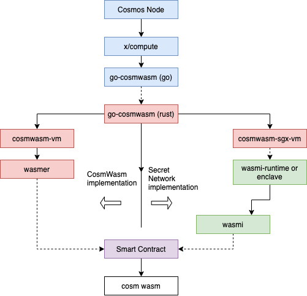

# Components

This section provides an overview of Secret Network, component by component. For more information, please refer to specific pages which go into more detail.

## Validators

The Secret Network validators are responsible for proposing new blocks to the blockchain, and confirming blocks proposed by other validators. A validator is a full node that can also propose and sign blocks. Validators must have adequate infrastructure to prevent downtime. Everyone who holds SCRT, however, can be a delegator. Delegators can delegate to validators they believe will maintain proper uptime, and will grow the blockchain through governance in what delegators feel is the right direction. Validators perform all the requested computations in each block via the `compute` module, which means all computations also occur as part of the consensus process. Validators run Intel SGX chips, and have gone through [remote attestation](sgx.md#remote-attestation), a process by which Intel SGX chips are verified. It will have also successfully completed a network registration process. As part of registration the validators are provisioned with the secret keys they need to participate in private computations. Validators run the Secret Network code, and execute WASM code within a TEE. They are responsible for achieving consensus on computation results, and proposing and/or validating new blocks in the Secret Network’s blockchain. Validators also participate in [governance](governance.md).

## Secret Contracts

Secret Contracts are code which executes over encrypted data. Secret Contracts are currently written in Rust (though this could be potentially expanded in the future to include AssemblyScript), and compile to WASM. Secret Contracts are public while the data they execute over is not. This enables users to have confidence that contracts will perform as functioned, while simultaneously ensuring that the data users submit cannot be viewed by any counterparty.

Contracts are stored on the Secret blockchain, where their code is publicly available. They execute inside the trusted part of Secret Network.

## Modules

The Secret Network blockchain currently contains the following modules. For a full description of each module, click to view module code.

- [auth](https://github.com/cosmos/cosmos-sdk/tree/v0.38.3/x/auth)
- [vesting](https://github.com/cosmos/cosmos-sdk/tree/v0.38.3/x/auth/vesting)
- [bank](https://github.com/cosmos/cosmos-sdk/tree/v0.38.3/x/bank)
- [crisis](https://github.com/cosmos/cosmos-sdk/tree/v0.38.3/x/crisis)
- [distribution](https://github.com/cosmos/cosmos-sdk/tree/v0.38.3/x/distribution)
- [evidence](https://github.com/cosmos/cosmos-sdk/tree/v0.38.3/x/evidence)
- [genutil](https://github.com/cosmos/cosmos-sdk/tree/v0.38.3/x/genutil)
- [gov](https://github.com/cosmos/cosmos-sdk/tree/v0.38.3/x/gov)
- [mint](https://github.com/cosmos/cosmos-sdk/tree/v0.38.3/x/mint)
- [params](https://github.com/cosmos/cosmos-sdk/tree/v0.38.3/x/params)
- [params client](https://github.com/cosmos/cosmos-sdk/tree/v0.38.3/x/params/client)
- [slashing](https://github.com/cosmos/cosmos-sdk/tree/v0.38.3/x/slashing)
- [staking](https://github.com/cosmos/cosmos-sdk/tree/v0.38.3/x/staking)
- [supply](https://github.com/cosmos/cosmos-sdk/tree/v0.38.3/x/supply)
- [upgrade](https://github.com/cosmos/cosmos-sdk/tree/v0.38.3/x/upgrade)
- [upgrade client](https://github.com/cosmos/cosmos-sdk/tree/v0.38.3/x/upgrade/client)

## Compute Module

Enigma is currently implementing the `compute` module, or `x/compute` for the Secret Network. This module will enable Secret Contract functionality, including encryption and decryption of state, as well as encrypted input/outputs for users.

## Client Library

The Secret Network client library is an API included in decentralized applications that enables them to easily communicate with Secret Contracts on the Secret blockchain. This component is still under development, but will most likely be built on top of CosmWasmJS, and include novel functions for specific tasks.

## Bootstrap Node

The bootstrap node is the first node to join the network. It is identical to other nodes, but is responsible for certain initialization processes.
